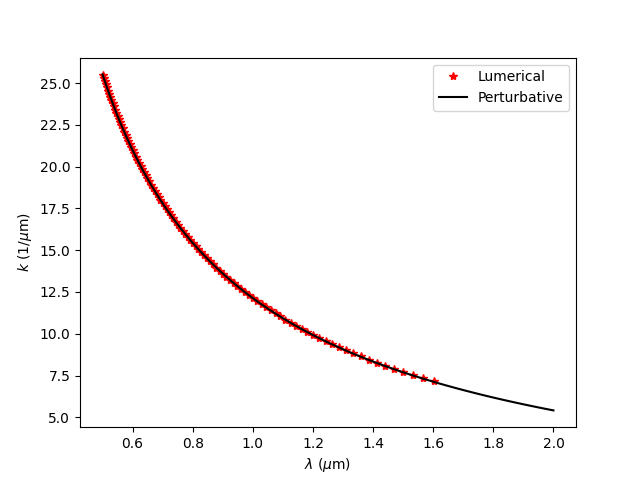

# Perturbative Waveguide Toolkit

A lightweight Python toolkit for perturbative effective-index calculations in integrated photonic waveguides.

This repository implements perturbative modal analysis methods inspired by the treatment presented in:

> Coldren, Corzine, and Mašanović,  
> *Diode Lasers and Photonic Integrated Circuits*,  
> 2nd Edition, Wiley.

The current implementation focuses on approximate effective-index calculations for silicon nitride (Si₃N₄) waveguides on silicon dioxide (SiO₂) substrates, including asymmetric slab-waveguide analysis, TE/TM modal fields, and perturbative corrections.

---

## Features

- Effective-index calculations for slab waveguides
- Asymmetric TE/TM mode analysis
- Modal field calculations
- Perturbative effective-index corrections
- Validation examples against Lumerical MODE simulations
- Lightweight and easily extensible Python implementation

---

## Repository Structure

```text
perturbative-waveguide-toolkit/
│
├── src/
│   └── perturbative_waveguides/
│
|── docs/
│   └── images/
|       └── lumerical_comparison.png
|
├── examples/
│
├── tests/
│
├── docs/
│
├── pyproject.toml
├── README.md
└── LICENSE
```

---

## Installation

Clone the repository and install it in editable mode:

```bash
git clone https://github.com/fdominguezserna/perturbative-waveguide-toolkit.git

cd perturbative-waveguide-toolkit

pip install -e .
```

---

## Example Usage

```python
from perturbative_waveguides import neffPerturb

neff = neffPerturb(...)
print(neff)
```

Additional examples are available in:

```text
examples/
```

---

## Minimal example

```python
from perturbative_waveguides import effective_index_perturbative

result = effective_index_perturbative(
    n1=1.44,
    n2=2.00,
    n3=1.00,
    lambda0=1.55,
    width=0.8,
    height=0.7,
    mode="TE",
    l=1,
    m=1,
    nps=3500,
)

print(result.neff_mode)
print(result.neffs)
```

---
## Validation Example

The repository includes comparison examples between perturbative calculations and full-vectorial simulations performed with Ansys Lumerical MODE Solutions.



Example comparison between:
- perturbative effective-index calculations, and
- Lumerical MODE simulations

for a Si₃N₄/SiO₂ waveguide geometry.

---

## Validation Disclaimer

The validation examples use identical material-dispersion models for both the perturbative calculations and the corresponding Lumerical MODE simulations. Additional implementation details are documented directly in the example scripts.


---

## References

L. A. Coldren, S. W. Corzine, and M. Mašanović,  
*Diode Lasers and Photonic Integrated Circuits*,  
2nd Edition, Wiley.

---

## Citation

If you use this repository in academic work, please cite the corresponding Zenodo release.

Example:

```text
Domínguez-Serna, Francisco A.,
Aguayo-Alvarado, Ana,
Barboza Tello, Norma,
De La Cruz Hernández, Wencel,
and Garay Palmett, Karina

Perturbative Waveguide Toolkit.
Zenodo (2026).
```

A BibTeX entry will be provided after the first Zenodo release.

---

## Acknowledgements

This work was partially supported by Secretaría de Ciencia, Humanidades, Tecnología e Innovación (SECIHTI). Ciencia de Frontera CF-2023-G-687, IIXM
(709/2018); MADTEC-2025-M-193; A. L. Aguayo-Alavarado thanks SECIHTI for the postdoctoral scholarship. 

---

## License

This project is released under the MIT License.